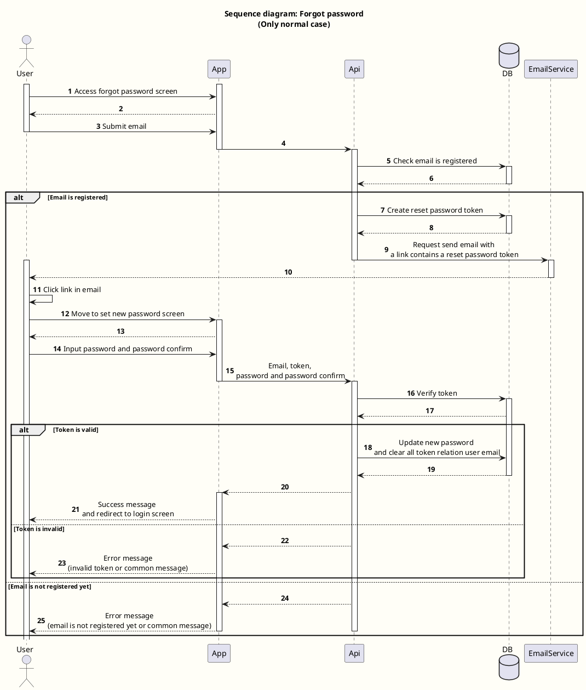

```plantuml
@startuml
autonumber
skinparam sequenceMessageAlign center
skinparam backgroundColor #FFFEF7
title **Sequence diagram: Forgot password**\n(Only normal case)

actor User
participant App
participant Api
database DB
participant EmailService

activate User
activate App
User -> App: Access forgot password screen
App --> User
User -> App: Submit email
deactivate User
App -> Api
deactivate App
activate Api
Api -> DB: Check email is registered
activate DB
DB --> Api
deactivate DB
alt Email is registered
  Api -> DB: Create reset password token
  activate DB
  DB --> Api
  deactivate DB
  Api -> EmailService: Request send email with \na link contains a reset password token
  deactivate Api
  activate EmailService
  activate User
  EmailService --> User
  deactivate EmailService
  User -> User: Click link in email
  User -> App: Move to set new password screen
  activate App
  App --> User
  User -> App: Input password and password confirm
  App -> Api: Email, token, \npassword and password confirm
  deactivate App
  activate Api  
  Api -> DB: Verify token
  activate DB
  DB --> Api
  alt Token is valid
    Api -> DB: Update new password \nand clear all token relation user email
    DB --> Api
    deactivate DB
    Api --> App
    activate App
    App --> User: Success message \nand redirect to login screen
  else Token is invalid
    Api --> App
    App --> User: Error message\n(invalid token or common message)
  end

else Email is not registered yet
  Api --> App
  App --> User: Error message\n(email is not registered yet or common message)
  deactivate App
  deactivate Api
end
@enduml
```