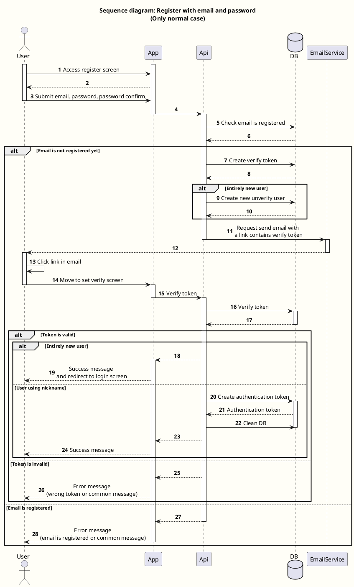

```plantuml
@startuml
autonumber
skinparam sequenceMessageAlign center
skinparam backgroundColor #FFFEF7
title **Sequence diagram: Register with email and password**\n(Only normal case)

actor User
participant App
participant Api
database DB
participant EmailService

activate User
activate App
User -> App: Access register screen
App --> User
User -> App: Submit email, password, password confirm
deactivate User
App -> Api
deactivate App
activate Api
Api -> DB: Check email is registered
DB --> Api
alt Email is not registered yet
  Api -> DB: Create verify token
  DB --> Api
  alt Entirely new user
    Api -> DB: Create new unverify user
    DB --> Api
  end
  Api -> EmailService: Request send email with \na link contains verify token
  deactivate Api
  activate EmailService
  EmailService --> User
  deactivate EmailService
  activate User
  User -> User: Click link in email
  User -> App: Move to set verify screen
  deactivate User
  activate App
  App -> Api: Verify token
  deactivate App
  activate Api
  Api -> DB: Verify token
  activate DB
  DB --> Api
  deactivate DB
  alt Token is valid
    alt Entirely new user
      Api --> App
      activate App
      App --> User: Success message \nand redirect to login screen
    else User using nickname
      Api -> DB: Create authentication token
      activate DB
      DB --> Api: Authentication token
      Api -> DB: Clean DB
      deactivate DB
      Api --> App
      App --> User: Success message
    end
  else Token is invalid
    Api --> App
    App --> User: Error message\n(wrong token or common message)
  end
else Email is registered
  Api --> App
  deactivate Api
  App --> User: Error message\n(email is registered or common message)
  deactivate App
end
@enduml
```